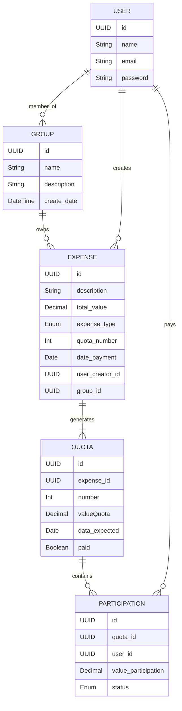

# 💰 Shared Expense Management System

This system aims to facilitate **control of fixed and variable monthly expenses** among user groups, with equal distribution of values among the assigned payers.

---

## 📘 Domain Concepts and Entities

### 🔹 `User`
Represents a system user.

- `name`
- `email`
- `password` (stored as hash)

---

### 🔹 `Group`
A group for sharing expenses, such as a family, republic, or group of friends.

- `name`
- `description`
- `create_date`
- **Relationship**: contains multiple `Users`

---

### 🔹 `Expense`
A record of an expense assigned to a group.

- `description`
- `total_value`
- `expense_type`: `ONE_TIME` or `INSTALLMENT`
- `quota_number` (if INSTALLMENT)
- `date_payment`
- `user_creator_id`
- `group_id`
- `payer_users` (direct list of users)

---

### 🔹 `Quota`
Represents a quota (installment) of the expense (if `expense_type = INSTALLMENT`).

- `number`
- `valueQuota`
- `data_expected`
- `paid`

---

### 🔹 `Participation`
Represents how much each `User` must pay in a `Quota`.

- `quota_id`
- `user_id`
- `value_participation`
- `status`: `PENDING` or `PAID`

---

## 🔄 Expense Registration Flow

1. A `User` creates a new `Expense`.
2. Selects the `Group` and the `payer_users`.
3. Fills in the total value, payment type, and date.
4. The system:
   - Creates the `Quotas` (if needed)
   - Splits the amount equally among the payers
   - Generates the `Participations` for each quota

---

## 🧮 Example

**Group:** `República da Praça`  
**Members:** João, Maria, Pedro  
**Payers:** João, Maria  
**Expense:** Internet - R$100.00 - à vista

**Result:**  
Each payer will have a `Participation` of R$50.00 marked as `PENDING` until payment is made.

---

## 📌 Future Considerations

- Possibility to assign custom weights per payer
- Monthly report generation by group or user
- Integration with notifications (email, WhatsApp, etc.)

---

## 📂 Entity-Relationship Diagram (ER)

